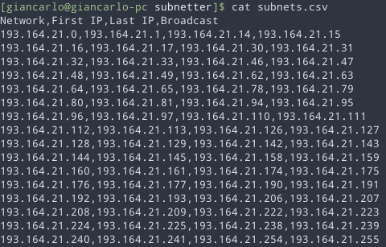

# Subnetter
This is a program that calculates the subnets of a network given the ipv4 network, mask and ammount of subnets to be calculated.
You can print the results to the terminal (default), or exporting them to a csv file if you ever need to.

## Usage

    USAGE:
        subnetter [FLAGS] [OPTIONS] <ip> <mask> <subnetworks>

    FLAGS:
        -d               Whenever print debug data or not
        -h, --help       Prints help information
        -V, --version    Prints version information

    OPTIONS:
        -p <path>        Save to a csv file

    ARGS:
        <ip>             IP to be subnetted
        <mask>           Mask of the IP to be subnetted
        <subnetworks>    Number of subnetworks to be computed

## Example

Using class address C 193.164.21.0, you need to generate 16 subnets. Make the table with the 16 subnets, the network and broadcast number, first and last usable ip of each subnet.

Printing result to terminal

Or exporting the output to a .csv

## Why?
On school I had a homework which was to do what this program does, it was boring and repetitive and I figured that I could calculate what was needed by using a program, because it was simple to do and didn't requiere much effort, but was very very boring.

